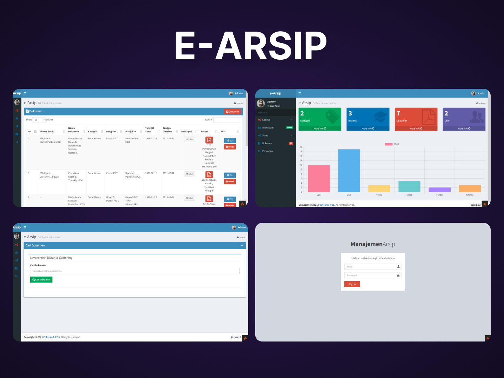

# E-Arsip

Aplikasi pengarsipan dengan melakukan implementasi *Algoritma Levenshtein Distance* pada fitur pencarian dokumen. Aplikasi ini dibuat menggunakan Framework *CodeIgniter 4*.

## Apa itu CodeIgniter?

CodeIgniter adalah sebuah *Framework* full-stack Web bahasa pemrograman PHP yang lebih Fleksibel, Cepat dan Aman. Untuk Informasi lebih lengkapnya cek di [official site](http://codeigniter.com)

Berikut beberapa tampilan Aplikasi E-Arsip :

## Server Requirements

PHP version 7.2 or higher is required, with the following extensions installed: 

- [intl](http://php.net/manual/en/intl.requirements.php)
- [libcurl](http://php.net/manual/en/curl.requirements.php) if you plan to use the HTTP\CURLRequest library

Additionally, make sure that the following extensions are enabled in your PHP:

- json (enabled by default - don't turn it off)
- [mbstring](http://php.net/manual/en/mbstring.installation.php)
- [mysqlnd](http://php.net/manual/en/mysqlnd.install.php)
- xml (enabled by default - don't turn it off)
